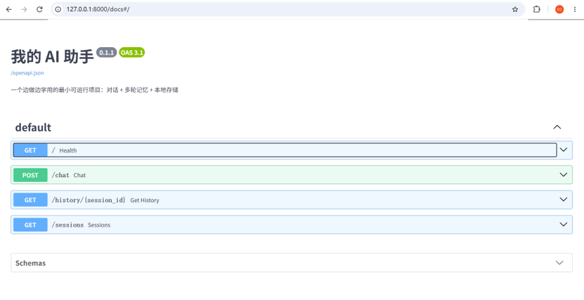
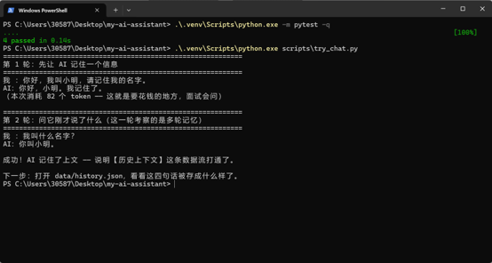
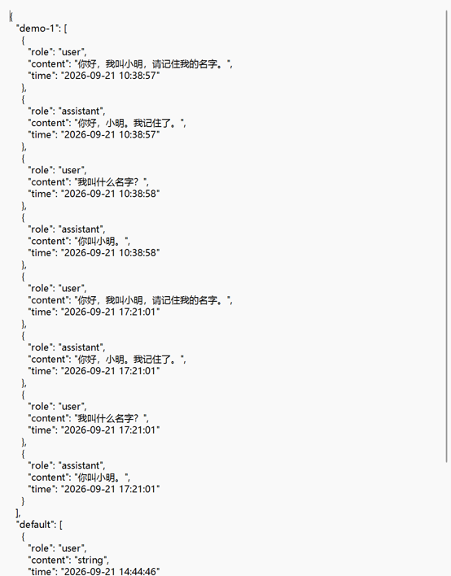

# 我的 AI 助手（my-ai-assistant）

一个边做边学用的 AI 应用：**对话 + 多轮记忆 + 本地存储 + RAG 知识库检索**。
回答不了的问题，可以让它「先查你自己的资料再答」（RAG），并返回引用了哪些文件。

## 这个项目是干什么的

可以跟大模型对话，并且它能记住同一会话里前面聊过的内容。

## 效果演示

### 1. 接口文档（FastAPI 自动生成，可直接在线调试）



### 2. 多轮对话实测：能记住上文

第一轮告诉它"我叫小明"，第二轮问"我叫什么名字"，它答"你叫小明"——
说明历史上下文这条数据流是通的。



### 3. 数据落在哪：本地文件存储（第一版方案）

每轮问答都会落到 `data/history.json`，按 session_id 分组保存。



## 数据流（看懂这张图，你就懂了这个项目）

```
网页 ──HTTP请求(JSON)──► main.py
                          │ ① 校验参数（models/schemas.py）
                          │ ② 业务处理（services/llm.py）
                          │      ├─► retriever.py 检索知识库  ★RAG
                          │      ├─► storage.py 读最近 6 轮历史
                          │      ├─► 调用大模型 API（资料 + 历史 + 问题）
                          │      └─► storage.py 写回这轮问答
                          │ ③ 返回 HTTP响应(JSON)
网页 ◄───────────────────┘

数据存在哪：
  .env                 → 密钥（本地文件，不上传）
  data/history.json    → 聊天记录（本地文件，第一版方案）
  data/knowledge/      → 知识库文档（.md/.txt，被检索的资料）
  logs/                → 程序日志
  内存                  → 正在处理的这条请求
```

## 目录结构

```
my-ai-assistant/
├── app/
│   ├── main.py            # 入口：定义接口，只管收/发，不写业务逻辑
│   ├── config.py          # 读配置（从 .env）
│   ├── models/schemas.py  # 数据结构定义（进出的数据长什么样）
│   ├── services/
│   │   ├── llm.py         # 调大模型（含 RAG 提示词拼装）
│   │   ├── retriever.py   # ★ 检索层：切块 / 打分 / 召回（RAG 的 R）
│   │   └── storage.py     # ★ 存储层：数据存在哪、怎么存
│   └── db/session.py      # 数据库连接（第二版的占位）
├── data/
│   ├── knowledge/         # 知识库文档（检索的数据源）
│   └── history.json       # 聊天记录
├── logs/                  # 日志
├── tests/                 # 测试
├── .env                   # 密钥（★不上传★）
├── .env.example           # 密钥模板（上传）
├── .gitignore             # 声明哪些文件不上传
├── pytest.ini
└── requirements.txt       # 依赖清单
```

## 怎么跑起来（三步）

**第 1 步：填密钥**
去 https://platform.deepseek.com 注册，创建 API Key，粘贴到 `.env` 文件里：
```
LLM_API_KEY=你的key
```

**第 2 步：装依赖**
```bash
python -m venv .venv
# 不用 activate，直接指定解释器（避免 PowerShell 脚本执行策略报错）
.venv\Scripts\python.exe -m pip install -r requirements.txt
```

**第 3 步：启动**
```bash
uvicorn app.main:app --reload --port 8000
```
然后浏览器打开 http://127.0.0.1:8000/docs ，在 `/chat` 接口上点 **Try it out**：
```json
{ "session_id": "test-1", "question": "你好，我叫小明" }
```
再发一次 `{"session_id": "test-1", "question": "我叫什么名字？"}` ——
如果它答出"小明"，说明**多轮记忆（历史上下文）跑通了**。

## 一键测试（不用看英文文档，直接跑）

先启动服务，然后另开一个终端执行：
```bash
.venv\Scripts\python.exe scripts\try_chat.py
```
它会自动做两轮对话：先告诉 AI 名字，再问它名字 —— 答对了就说明多轮记忆跑通了。

## 接口清单

| 方法 | 路径 | 作用 |
| --- | --- | --- |
| GET | `/` | 健康检查 |
| POST | `/chat` | 提问并获取回答 |
| GET | `/history/{session_id}` | 查某个会话的历史 |
| GET | `/sessions` | 列出所有会话 |
| GET | `/knowledge` | 看知识库有哪些文件、切了多少块 |
| POST | `/knowledge/reload` | 改了知识库文档后重建索引 |
| GET | `/search?q=xxx` | **只做检索、不调模型**，用来观察 RAG 检索到了什么 |

## 跑测试

```bash
pytest -v
```

## 技术栈

Python · FastAPI · Pydantic · python-dotenv · openai SDK（兼容 DeepSeek 等）· pytest

## 已实现 / 下一步计划

- [x] 基础对话接口
- [x] 多轮对话（最近 6 轮上下文）
- [x] 本地文件持久化 + 按会话隔离
- [x] 参数校验 + 明确的错误提示
- [x] 基础单元测试
- [x] 一键测试脚本（scripts/try_chat.py）
- [ ] 第二版：存储换成 MySQL（只改 services/storage.py）
- [ ] 第二版：加 Redis 缓存会话上下文
- [x] 第三版①：RAG 检索（文档切块 → 关键词检索 → 拼进提示词 → 返回引用来源）
- [ ] 第三版②：把检索器换成**向量检索**（Embedding + 向量库），并对比两者召回率
- [ ] 第三版：Rerank 重排 + 引用溯源
- [ ] 第四版：Docker 容器化 + 部署到云服务器
- [ ] 第四版：压测出 QPS / P99 / Token 成本数据

## 设计说明（面试可讲的部分）

**1. 为什么第一版用本地文件，而不是直接上 MySQL？**
数据量小、零配置，能最快跑起来验证想法。文件方案的三个致命问题：
不能并发写、不能高效查询、不能放很大。等这些问题真实出现时再换数据库，
这样每一步升级都有明确理由，而不是为了堆技术栈。

**2. 为什么代码要分层？**
`main.py` 只管收发请求，业务逻辑在 `services/`，存储细节在 `storage.py`。
好处：换数据库时只改 `storage.py`，上层一行都不用动；也便于单独写测试。

**3. 为什么只给模型最近 6 轮历史？**
模型能读的长度有限（上下文长度），而且每个 token 都要花钱。
所以做了截断，只保留最近几轮 —— 这是成本与效果的取舍。

**4. 密钥为什么放 .env 而不是写在代码里？**
代码要上传 GitHub，密钥写进代码等于公开。`.env` 已在 `.gitignore` 里排除，
只上传 `.env.example` 模板（写变量名、不写值）。

**5. 为什么第一版 RAG 用关键词检索，而不是向量检索？**
因为要先跑通「检索 → 增强 → 生成」这条数据流。关键词检索零新增依赖、零额外 API Key，
当天就能验证整条链路。检索器和存储层一样是可替换的零件 —— 换成向量检索时只改
`retriever.py` 一个文件，还能用同一组问题对比两者的召回率，这比直接说"我用了向量库"
更有说服力。

**6. 切块为什么要留重叠（overlap）？**
如果按固定长度硬切，一句关键的话可能刚好被切成两半，两个块都不完整，检索时就漏掉了。
留 50 字重叠能保证边界上的语义至少完整地出现在其中一块里。

**7. RAG 的代价是什么？**
首答的 Token 消耗从 93 涨到 693（约 7 倍）—— 因为要把检索到的资料一起塞进上下文。
所以 RAG 是「准确性换成本」的取舍：资料块数和 top_k 都不能无限加大。
不启用 RAG 时，模型会诚实地说"我无法确认"，而不是编造 —— 这也是提示词里明确要求的。

我的第一个 AI 项目，2026-09-21